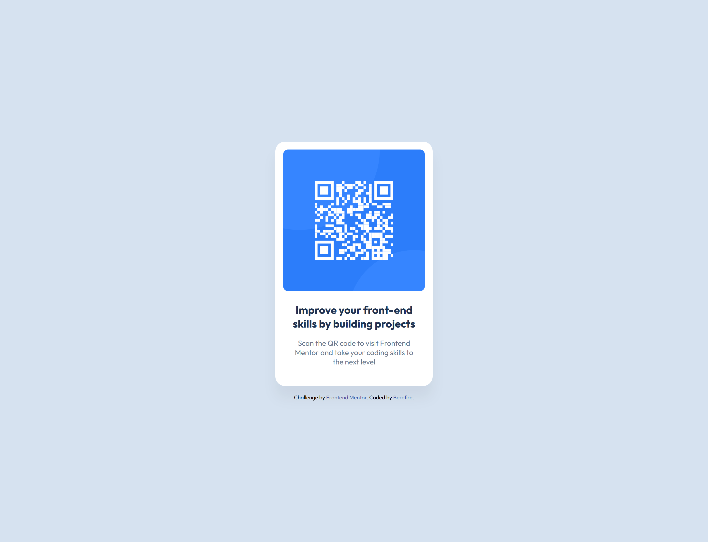
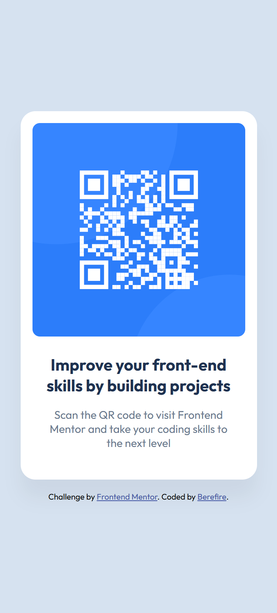

# Frontend Mentor - QR code component solution

This is a solution to the [QR code component challenge on Frontend Mentor](https://www.frontendmentor.io/challenges/qr-code-component-iux_sIO_H). Frontend Mentor challenges help you improve your coding skills by building realistic projects.

## Table of contents

- [Overview](#overview)
  - [Desktop Screenshot](#desktop-screenshot)
  - [Mobile Screenshot](#mobile-screenshot)
  - [Links](#links)
- [My process](#my-process)
  - [Built with](#built-with)
  - [What I learned](#what-i-learned)
  - [Continued development](#continued-development)
  - [Useful resources](#useful-resources)
- [Author](#author)

## Overview

### Desktop Screenshot



### Mobile Screenshot



### Links

- Solution URL: [Add solution URL here](https://your-solution-url.com)
- Live Site URL: [Add live site URL here](https://your-live-site-url.com)

## My process

### Built with

- Semantic HTML5 markup
- CSS custom properties
- Flexbox for alignment
- Mobile-first workflow
- Google Fonts (Outfit)

### What I learned

During this project, I practiced:

- Centering layouts using Flexbox.

```css
body {
  background-color: var(--slate-300);
  font-family: "Outfit", sans-serif;
  display: flex;
  flex-direction: column;
  justify-content: center;
  align-items: center;
  min-height: 100vh;
  padding: 1.5rem;
}
```

- Setting maximum width for responsive components.

```css
.card {
  background-color: var(--white);
  padding: 1rem;
  border-radius: 20px;
  width: 100%;
  max-width: 320px;
  box-shadow: 0 25px 25px rgba(0, 0, 0, 0.05);
  text-align: center;
}
```

- Using consistent spacing and border-radius values.

```css
.card__image {
  border-radius: 10px;
  width: 100%;
  display: block;
}
```

- Following clean file structure practices.
- Writing accessible HTML, including alt text and hierarchy.
- Applying the **BEM (Block Element Modifier)** methodology to structure CSS classes more clearly. Example: `card`, `card__image`, `card__title`, `card__attribution--link`

### Continued development

I want to keep improving in:

- Pixel-perfect implementations.
- Advanced responsive typography.
- Component-based design thinking.
- Accessibility best practices (ARIA, color contrast).
- Scaling BEM with larger layouts.

### Useful resources

- [MDN Web Docs](https://developer.mozilla.org/) - A great encyclopedia to consult CSS properties.
- [CSS Tricks Flexbox Guide](https://css-tricks.com/snippets/css/a-guide-to-flexbox/) - This is an amazing article which helped me finally understand Flexbox. I'd recommend it to anyone still learning this concept.
- [Google Fonts](https://fonts.google.com/) - In this site you can obtain any font that you want to design your web site

## Author

- Frontend Mentor - [@berefire](https://www.frontendmentor.io/profile/berefire)
