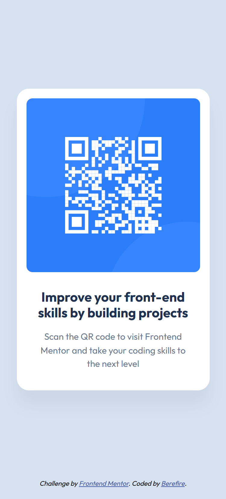
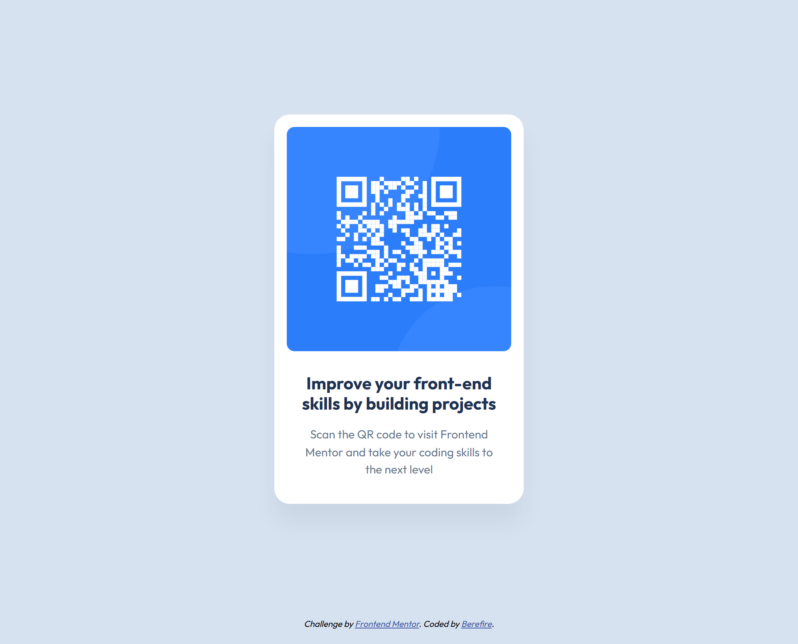

# Frontend Mentor - QR code component solution

This is a solution to the [QR code component challenge on Frontend Mentor](https://www.frontendmentor.io/challenges/qr-code-component-iux_sIO_H). Frontend Mentor challenges help you improve your coding skills by building realistic projects.

This project focuses on building a clean, accessible, and scalable QR code component using modern CSS architecture principles.

---

- [Overview](#-overview)
  - [The challenge](#️-the-challenge)
  - [Screenshot](#-screenshot)
  - [Links](#-links)
- [My process](#my-process)
  - [Built with](#️-built-with)
  - [Features](#-features)
  - [What I learned](#-what-i-learned)
  - [Accessibility](#-accessibility)
  - [Continued development](#-continued-development)
  - [Useful resources](#-useful-resources)
- [Author](#-author)
- [Acknowledgments](#-acknowledgments)

---

## 📋 Overview

The challenge is to build a QR code component and make it visually as close as possible to the provided design, using clean semantic HTML, modern CSS, and good accessibility practices.

This solution follows a modular and scalable CSS architecture inspired by CUBE CSS and Every Layout principles.

---

### 🎖️ The challenge

Users should be able to:

- View the QR code component on different screen sizes
- Read the text content clearly with proper visual hierarchy
- See a centered card layout without layout shifts
- View responsive images that scale correctly across devices
- Navigate the content using keyboard and assistive technologies

---

### 📸 Screenshot

| _Mobile Preview (375x914)_                     | _Desktop Preview (1024x914)_                 |
| ---------------------------------------------- | -------------------------------------------- |
|      |  |

---

### 🔗 Links

- Solution URL: [https://www.frontendmentor.io/solutions/qr-code-component-using-flexbox-and-bem-architecture-pLDZeBwf0o](https://www.frontendmentor.io/solutions/qr-code-component-using-flexbox-and-bem-architecture-pLDZeBwf0o)
- Live Site URL: [https://berefire.github.io/qr-code-component](https://berefire.github.io/qr-code-component/)

---

## My process

---

### 🛠️ Built with

- Semantic HTML5
- CSS Custom Properties (Design Tokens)
- Flexbox and CSS Grid
- Mobile-first workflow
- BEM methodology for components
- CUBE CSS architecture
- Every Layout patterns (Center, Stack, Box)
- Local font loading with `@font-face`
- Responsive design with `clamp()`
- Lighthouse performance optimization

---

### ✨ Features

- Centered card layout using intrinsic design
- Responsive typography and spacing
- Modular and scalable CSS architecture
- Reusable layout patterns
- Custom font loading with fallback support
- Accessible links and focus styles
- Optimized for performance and maintainability

---

### 📚 What I learned

During this project, I reinforced and improved my understanding of:

- Applying CUBE CSS and Every Layout principles in real projects
- Structuring scalable styles using BEM and utility classes
- Creating reusable layout patterns instead of page-specific layouts
- Managing design consistency with CSS custom properties
- Building intrinsic layouts without relying heavily on media queries
- Debugging CSS using cascade, specificity, and DevTools
- Improving Lighthouse scores through better asset loading
- Implementing accessible link and focus styles
- Writing maintainable CSS by separating base, composition, utilities, and blocks

---

### ♿ Accessibility

This project follows WCAG 2.1 AA accessibility guidelines by:

- Using semantic HTML elements such as `main`, `section`, and `address`
- Providing meaningful `alt` text for images
- Ensuring links are distinguishable beyond color
- Supporting keyboard navigation with `:focus-visible`
- Using scalable units for typography and spacing
- Respecting user motion preferences

Accessibility was considered from the beginning of the development process.

---

### 🚀 Continued development

In future projects, I plan to:

- Perform more advanced accessibility audits
- Explore automated testing tools
- Improve font loading strategies
- Implement dark mode using CSS variables
- Create reusable project templates
- Continue refining CSS architecture
- Explore more advanced Every Layout patterns

---

### 📖 Useful resources

- [MDN Web Docs](https://developer.mozilla.org/)  
  Comprehensive documentation for HTML and CSS.

- [Every Layout](https://every-layout.dev/)  
  Practical layout patterns by Andy Bell and Heydon Pickering.

- [CUBE CSS](https://cube.fyi/)  
  CSS architecture methodology by Andy Bell.

- [CSS Tricks Flexbox Guide](https://css-tricks.com/snippets/css/a-guide-to-flexbox/)  
  Helped reinforce Flexbox layout concepts.

- [Google Fonts Helper](https://gwfh.mranftl.com/fonts)  
  Used as reference for self-hosted fonts.

---

## 👤 Author

- Frontend Mentor - [@berefire](https://www.frontendmentor.io/profile/berefire)
- GitHub - [@berefire](https://github.com/berefire)

---

## 🙏 Acknowledgments

Thanks to Frontend Mentor for providing high-quality challenges that help developers grow through consistent practice.

Special thanks to Andy Bell and Heydon Pickering for their work on CUBE CSS and Every Layout, which strongly influenced this project’s architecture.
